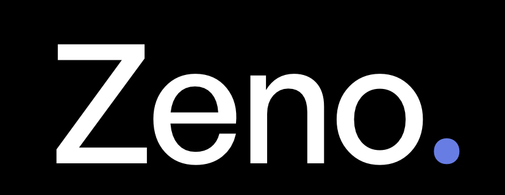

# Zeno Wallet



[](https://github.com/ZenoMD/zeno-xaman/actions/workflows/deploy.yml)
[![Open in Xaman](https://img.shields.io/badge/Open%20with-Xaman-0030CF?labelColor=000000&logo=data%3Aimage%2Fsvg%2Bxml%3Bbase64%2CPHN2ZyB4bWxucz0iaHR0cDovL3d3dy53My5vcmcvMjAwMC9zdmciIHZpZXdCb3g9IjAgMCAxOCAyMCI%2BPHBhdGggZmlsbD0iI2ZmZiIgZD0iTTEyLjQyMTggMTAuNDc5TDE1Ljk1NzMgMTQuMDY0QzE2LjcyMTcgMTQuODMyMiAxNy4xMDM5IDE1LjQ5MzcgMTcuMTAzOSAxNi4wNDg1QzE3LjEwMzkgMTYuNTgyIDE2LjcyMTcgMTcuMjMyOCAxNS45NTczIDE4LjAwMUMxNS4xOTI4IDE4Ljc0NzkgMTQuNTQ1MiAxOS4xMjE0IDE0LjAxNDMgMTkuMTIxNEMxMy40ODM1IDE5LjEyMTQgMTIuODM1OSAxOC43MzcyIDEyLjA3MTQgMTcuOTY5TDguNTY3ODUgMTQuNDE2MUw1LjAzMjQxIDE3Ljk2OUM0LjI2ODAyIDE4LjczNzIgMy42MjAzNyAxOS4xMjE0IDMuMDg5NTMgMTkuMTIxNEMyLjU3OTkxIDE5LjEyMTQgMS45MzIyOCAxOC43NDc5IDEuMTQ2NjMgMTguMDAxQzAuMzgyMjA5IDE3LjIzMjggMCAxNi41ODIgMCAxNi4wNDg1QzAgMTUuNDkzNyAwLjM4MjIwOSAxNC44MzIyIDEuMTQ2NjMgMTQuMDY0TDQuNjgyMDggMTAuNDc5TDEuMTQ2NjMgNi44OTQwN0MwLjM4MjIwOSA2LjEyNTg3IDAgNS40NzUgMCA0Ljk0MTU1QzAgNC4zODY3MiAwLjM4MjIwOSAzLjcyNTIgMS4xNDY2MyAyLjk1N0MxLjkzMjI4IDIuMTg4NzkgMi41Nzk5MSAxLjgwNDY5IDMuMDg5NTMgMS44MDQ2OUMzLjYyMDM3IDEuODA0NjkgNC4yNjgwMiAyLjE4ODc5IDUuMDMyNDEgMi45NTdMOC41Njc4NSA2LjU0MTk2TDEyLjA3MTQgMi45NTdDMTIuODM1OSAyLjE4ODc5IDEzLjQ4MzUgMS44MDQ2OSAxNC4wMTQzIDEuODA0NjlDMTQuNTQ1MiAxLjgwNDY5IDE1LjE5MjggMi4xODg3OSAxNS45NTczIDIuOTU3QzE2LjcyMTcgMy43MjUyIDE3LjEwMzkgNC4zODY3MiAxNy4xMDM5IDQuOTQxNTVDMTcuMTAzOSA1LjQ3NSAxNi43MjE3IDYuMTI1ODcgMTUuOTU3MyA2Ljg5NDA3TDEyLjQyMTggMTAuNDc5WiIvPjwvc3ZnPgo%3D)](https://xumm.app/detect/xapp:sandbox.c654c6cc8425)

Convenient and compliant private payments on XRPL

## About

Zeno is a xApp for Xaman wallet that allows unlocks private payments from your existing XRPL account. 

Simply open the xApp and then shield/transfer/unshield XRP and other tokens. 

The Zeno shielded pool is a permissioned domain and KYC is required for entry so users can be sure they are not interacting with bad actors. Access is currently via whitelist until a suitable KYC partner can be found. To apply please install Xaman and complete the online form

https://forms.gle/wQ8fKFYXetboBTp7A

## Architecture

Zeno uses the well established and trusted RAILGUN protocol (currently securing over $77 million) deployed to the XRPL EVM sidechain as the underlying shielded pool. Users do not require an EVM address thanks to a number of bridging and gas sponsoring tricks.

- Deposits go via the canonical Axelar bridge directly into the pool. EVM gas is paid by the Axelar relay
- Shielded transfers/withdrawals are relayed via our custom broadcasting service and the broadcasters are reimbursed for gas with shielded tokens. This also preserves privacy by ensuring transfers do not have the spenders public signature attached

The result is full account abstraction of the EVM chain and spend authorization directly tied to the XRPL wallet keys.

Zeno is also a [permissioned domain](https://xls.xrpl.org/xls/XLS-0080-permissioned-domains.html). It handles compliance in an XRPL native way requiring approved credentials before deposits into the pool are allowed.

## Local Development

Uses [Bun](https://bun.sh/)

```shell
bun install
bun run dev
```

To test it within the Xaman wallet you will need to use [cloudflare tunnels](https://developers.cloudflare.com/tunnel/) or similar to obtain a public URL

```shell
cloudflared tunnel --url http://localhost:3000
```

Attach the resulting URL to a xApp in the [Xaman developer console](https://apps.xaman.dev/) and test either on-device or using the xAppBuilder application.

### Contracts

See [README](./contracts/README.md)

## Running as a web app (browser/web3)

The app also runs as a normal web app in a browser tab, outside the Xaman xApp
WebView. It detects the environment at runtime (see `lib/runtime.ts`):

- **Xaman xApp** — the session is established automatically and the wallet boots
  immediately.
- **Browser** — the user is shown a "Sign in with Xaman" button that runs the
  [browser/web3](https://docs.xaman.dev/environments/browser-web3) OAuth2 flow
  (QR sign-in on desktop, deeplink redirect on mobile). A restored 24h session
  signs the user straight back in without a click.

Both paths use the same `NEXT_PUBLIC_XUMM_API_KEY`. For the browser flow to
work you must register the app's URL in the
[Xaman developer console](https://apps.xaman.dev/) under **Origin/Redirect URIs
(one per line)** on the application home page — add every origin you serve from,
e.g. `http://localhost:3000` for local dev and your production URL. The SDK uses
the current page URL as the OAuth return URL, so an unlisted origin is rejected.

## License

[AGPL-3.0](LICENSE), except the contracts in [contracts/](./contracts), which are [MIT](./contracts/LICENSE)
